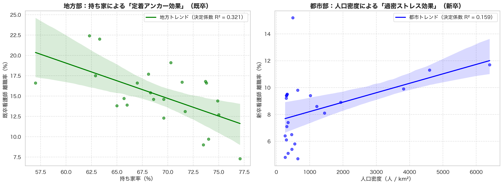
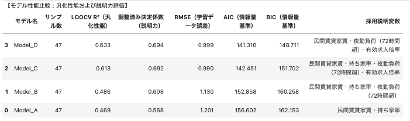

# 🏥 Data-Driven Approach to Nurse Retention in Japan  
**オープンデータ統合による構造的な看護師離職要因の定量整理（都道府県別）**


---

## 🚧 Work in Progress

本リポジトリは、公開統計の統合から分析までを  
<b>「再現可能なデータパイプライン」として整理すること</b>を目的に継続改善しています。

本分析はデータサイエンス講座の課題として開始しましたが、  
現在は <b>データ統合プロセスを含めた設計整理</b>に重点を置いて発展させています。

---

### 📊 現在の到達点

- 47都道府県の公開統計を統合した分析用マスタデータを構築
- マスタデータを用いた離職構造分析を実施
  - 探索的データ分析（EDA）
  - 回帰モデルによる要因整理

---

### ⚙ データ統合の現状

- 複数形式（PDF / Excel / CSV）の統計資料を統合
- 一部資料は構造差が大きく、現在は手動統合CSVを使用
- 再現性向上のため、Rawデータから再生成するPython統合処理を段階的に整備中

---

### ✅ 実施しているデータ品質検証

- 行数確認
- 主キー重複チェック
- 欠損値確認

---

### 🚀 今後の改善計画

- 手動統合資料のETL化
- 統合処理の構造リファクタリング
- データ定義書および品質チェックの拡充
- 新卒・既卒および都市・地方別分析の拡張


## Development Status

| Component | Status |
|-----------|------------|
| Data Integration | 🔄 Refactoring into reproducible Python ETL pipeline |
| Data Quality Validation | ✅ Implemented |
| Exploratory Analysis | ✅ Implemented |
| Modeling | ✅ Implemented (Baseline structural model completed) |
| Interpretation | ✅ Implemented (Structural hypothesis derived) |
| Subgroup Modeling | 🔄 In Progress |
| Visualization Assets | 🟡 Expanding for presentation |
| Documentation | 🟡 Expanding |


## ⚡ 3-Second Summary
- 47都道府県統計を統合し、看護師離職率の構造要因を分析  
- PDF/CSVなど形式差・定義差がある統計を扱い、作成手順を残すことを重視
- Raw統計から分析データを再生成できるETL設計を目指す
---

---

## 📚 Documentation

- データ定義書：`docs/data_dictionary.md`

---

## 📖 Overview

<b>「看護師の離職は、政策や制度設計によって改善できる構造課題ではないのか？」</b>

臨床現場で離職を繰り返し目にする中で、離職は個人の意思や適性だけでなく、労働環境や生活コスト、<br>
地域の労働市場構造といった外部要因の影響も大きいのではないかと考えました。

本プロジェクトでは、これらの構造要因をデータから検証しました。

---

## 🔑 Key Findings

- 離職率は「個人要因」だけでなく、**労働負荷・生活コスト・労働市場**と整合的な関連が見られた  
- **都市部 vs 地方**など、地域構造によって離職パターンが異なる可能性が示唆された  
- データ品質が結果の信頼性を左右することを確認した  



※ 地方では持ち家率が既卒看護師の定着と負の関連、都市部では人口密度が新卒離職と正の関連を示した（探索的検証）

---

## 🎯 Model Selection（Global Model）

最終的に **全体離職率（turnover_total）のモデルは Model D** を採用しました。



**採用理由（要点）**
- 説明力を維持しつつ、変数数を抑えて解釈性を向上  
- LOOCVにより予測安定性を確認  
- 情報量基準（AIC/BIC）を含めた総合評価で最もバランスが良かった  

※ 詳細なモデル比較・診断は `04_modeling.ipynb` を参照

---

## 🧩 Extension: Subgroup Analysis

全国一律モデルでは説明しきれない構造差を検証するため、  
離職要因が **キャリア段階 × 地域構造** によって異なる可能性を探索しました。

**方法（最小限）**  
都道府県を人口密度中央値（259.6人/km²）で2群に分類（Urban / Rural）

**主な示唆**
- **地方 × 既卒**：持ち家率が高いほど離職率が低い傾向（定着アンカー仮説）  
- **都市 × 新卒**：人口密度が高いほど離職率が高い傾向（密度ストレス仮説）  

※ 本分析は探索的検証であり因果関係を示すものではない  
※ 行政区分ではなく統計的区分を使用  
※ 再現手順は `06_subgroup_analysis.ipynb` を参照（同一マスターデータ基盤）

## 🛠 How the Data is Structured

本プロジェクトでは、公開統計データを統合し、
Rawデータとコードから分析用データを再生成できる構造を意識して作成しています。

公的統計は、定義や単位、集計粒度が資料ごとに異なることが多いため、
分析結果の解釈がぶれないよう、以下の点を意識してデータを整理しています。

---

### 1) Rawデータの保持
- `data/raw`：取得したデータをそのまま保存  
- `data/processed`：加工後のデータを分けて管理  

---

### 2) 変数定義の整理
- 変数名を統一  
- 出典・単位・定義を整理  

---

### 3) データ品質の確認
- 都道府県キーが重複していないか  
- 行数が47都道府県分そろっているか  
- 欠損値や異常値の確認  

---

### 4) 再現性を意識した構成
- 抽出・整形・分析を Notebook 単位で分離  
- 再実行時にどこで問題が起きたかを確認しやすい構造にしています  


---

## 🔍 Analysis Flow
1. **Data Validation**  
   統計資料ごとの定義差・欠損・分布を確認  
2. **Exploratory Data Analysis（EDA）**  
   地域差の可視化、都市部・地方部の構造差を把握  
3. **Modeling**  
   回帰分析により離職率に関連する主要因子を推定  
4. **Interpretation**  
   統計結果と臨床経験を統合し、構造的背景を仮説として整理<br>
   回帰モデルで得られた係数を、現場で理解しやすいスケールに変換し、<br>
   離職に影響する構造要因を整理した。

<p align="center">
  
</p>

　　統計的な係数をそのまま提示するのではなく、<br>
　　現場の意思決定に活用できる形へ翻訳することを重視した。
5. **Subgroup Analysis**  
   新卒/既卒など、集団差で構造が変わるかを検証  

---

## 📦 Master Dataset

統合マスターデータは `prefecture` を主キーとして構成されています。

---

### 🎯 目的変数

| 変数名 | 説明 |
|---------|------------|
| turnover_total | 総離職率 |
| turnover_new_grad | 新卒離職率 |
| turnover_experienced | 既卒離職率 |

---

### 🏥 労働環境

| 変数名 | 説明 |
|---------|------------|
| night_shift_72h_plus | 月72時間以上の夜勤割合 |
| overtime_hours | 平均残業時間 |
| nurse_per_100k | 人口10万人あたり看護師数 |
| average_age | 平均年齢 |
| annual_income | 平均年収 |

---

### 📊 労働市場構造

| 変数名 | 説明 |
|---------|------------|
| job_openings_ratio | 有効求人倍率 |

---

### 🏠 生活基盤・住宅安定性

| 変数名 | 説明 |
|---------|------------|
| rent_private | 民間賃貸住宅家賃 |
| home_ownership_rate | 持ち家率 |

---

### 🌍 地域人口構造

| 変数名 | 説明 |
|---------|------------|
| population | 総人口 |
| population_density | 人口密度 |


---

## 💻 Quickstart

### 1) リポジトリ取得
```bash
git clone https://github.com/<your-username>/nurse-turnover-analysis.git
cd nurse-turnover-analysis

2) 依存関係インストール
pip install -r requirements.txt

3) Notebookを上から順に実行すると、rawデータから master データが再生成されます。

jupyter notebook

推奨実行順：
notebooks/00_extract_from_pdf.ipynb

notebooks/01_create_master_dataset.ipynb

notebooks/02_data_validation.ipynb

notebooks/03_eda_overview.ipynb

notebooks/04_modeling.ipynb

notebooks/05_interpretation.ipynb

notebooks/06_subgroup_analysis.ipynb

生成物：

data/processed/master_nurse_turnover.csv

## 📁 Project Structure

nurse-turnover-analysis/
│
├── data/
│   ├── raw/
│   ├── out/  
│   └── processed/
│
├── notebooks/
│   ├── 00_extract_from_pdf.ipynb
│   ├── 01_create_master_dataset.ipynb
│   ├── 02_data_validation.ipynb
│   ├── 03_eda_overview.ipynb
│   ├── 04_modeling.ipynb
│   ├── 05_interpretation.ipynb
│   └── 06_subgroup_analysis.ipynb
│
├── src/
│   └── ETL処理およびデータ変換ロジックのモジュール化を想定（現在リファクタリング中）├── outputs/
│   └── figures/
│ 
│
└── README.md


***

## ⚠️ Limitations & Scope

本分析は相関構造の整理を目的としており、因果関係を証明するものではありません

解釈には臨床経験に基づく仮説が含まれます（政策提言は示唆の範囲）

都道府県単位の集計データのため、施設・個人単位の違いを直接説明するものではありません

***


👤 Author  
Hideomi Hayakawa
